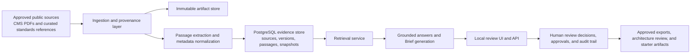

# HealthForge

HealthForge is an open-source AI engineering platform for healthcare interoperability.

It turns authoritative healthcare regulations and implementation guidance into traceable, reviewable engineering outputs: cited answers, Briefs, architecture guidance, validation results, and downstream implementation artifacts.

## Why this project exists

Healthcare teams often need to answer questions like:

- What does a CMS rule require for this workflow?
- What changes do we need in prior authorization workflows?
- Which findings are grounded in source evidence versus interpretation?
- How do we review and approve those findings before engineering starts?

HealthForge is designed to answer those questions with a bounded, evidence-first workflow instead of a generic chatbot experience.

## What HealthForge does today

The current MVP can:

- ingest approved public source documents such as CMS PDFs
- extract citeable passages and store them in a structured local evidence database
- organize evidence into reproducible corpus snapshots
- answer bounded questions using retrieved evidence plus project context
- create reviewable Briefs with cited findings
- support reviewer decisions, approvals, and audit history
- export approved work items for downstream engineering planning
- validate synthetic or non-sensitive FHIR examples against a pinned R4 validation catalog
- generate bounded architecture-review artifacts and guarded example starter artifacts

## Current status

Phase 3 is completed.

The working platform now includes:

- a local review UI
- a Spring Boot API
- PostgreSQL-backed evidence storage
- persisted Brief review workflows
- deterministic FHIR validation
- standards artifact lookup
- architecture-review artifacts
- approved work-item export
- guarded example-only starter code generation

The MVP is intentionally bounded:

- public, non-sensitive sources only
- synthetic or non-sensitive FHIR examples only
- human review required for recommendations and exports
- no production PHI handling
- no direct external system writeback in the MVP

## Quick start

Prerequisites:

- Java 21+
- Maven 3.9+
- Docker Desktop

Start the full local stack:

```bash
docker compose -f infra/docker/docker-compose.yml up --build -d
```

Open the app:

- UI: `http://localhost:8080`
- Health: `http://localhost:8080/actuator/health`

If you want the API-only local dev loop:

```bash
docker compose -f infra/docker/docker-compose.yml up -d
cd apps/platform-api
mvn spring-boot:run
```

## First demo flow

The first usable vertical slice is the Regulation-to-Engineering Brief workflow:

1. Ingest an approved public source document with provenance.
2. Ask a bounded engineering or workflow question.
3. Retrieve grounded evidence from a pinned corpus snapshot.
4. Create a reviewable Brief from cited findings.
5. Accept, correct, reject, and approve findings through a human review workflow.
6. Export approved implementation work items for downstream engineering planning.

## How to test it

There are two simple ways to test the MVP.

### 1. Test through the local UI

Open `http://localhost:8080` and try one of these:

Example 1

- Question: `What changes do we need for CMS prior authorization workflows?`
- Project context: `Synthetic provider EHR planning scenario for prior authorization APIs.`

Expected outcome:

- grounded evidence is found
- a reviewable Brief can be created
- findings include citations to CMS source passages

Example 2

- Question: `What does CMS-0057-F require for prior authorization APIs?`
- Project context: `Internal product planning for a non-sensitive prior authorization workflow MVP.`

Expected outcome:

- findings are tied to the CMS final rule
- the review and approval workflow is available

Example 3

- Question: `How should a provider workflow handle documentation and status exchange for prior authorization?`
- Project context: `Synthetic architecture review for a provider-facing utilization management workflow.`

Expected outcome:

- grounded findings are returned
- the result is useful as architecture-review input

### 2. Test through the API

Health check:

```bash
curl -s http://localhost:8080/actuator/health
```

Expected result:

```json
{"status":"UP","groups":["liveness","readiness"]}
```

Grounded answer:

```bash
curl -s -X POST http://localhost:8080/v1/answers \
  -H 'Content-Type: application/json' \
  -d '{
    "corpus_id":"mvp-regulatory-corpus",
    "corpus_version":"2026-07-24-expanded-web-core-v4",
    "question":"What changes do we need for CMS prior authorization workflows?",
    "project_context":"Synthetic provider EHR planning scenario for prior authorization APIs."
  }'
```

Expected result:

- `status` is `grounded`
- the response includes `findings`
- each finding includes source/version/locator citation data

Direct retrieval search:

```bash
curl -s -X POST http://localhost:8080/v1/retrieval/search \
  -H 'Content-Type: application/json' \
  -d '{
    "corpus_id":"mvp-regulatory-corpus",
    "corpus_version":"2026-07-24-expanded-web-core-v4",
    "query":"CMS prior authorization workflow changes",
    "limit":5
  }'
```

Create a reviewable Brief:

```bash
curl -s -X POST http://localhost:8080/v1/briefs \
  -H 'Content-Type: application/json' \
  -H 'X-HealthForge-Actor: local.reviewer' \
  -H 'X-HealthForge-Role: reviewer' \
  -d '{
    "corpus_id":"mvp-regulatory-corpus",
    "corpus_version":"2026-07-24-expanded-web-core-v4",
    "question":"What changes do we need for CMS prior authorization workflows?",
    "project_context":"Synthetic provider EHR planning scenario for prior authorization APIs."
  }'
```

Expected result:

- a persisted `brief_id`
- findings, sources, summary, and audit events
- follow-up review actions available through the UI and API

## Current architecture

The MVP architecture is intentionally simple, local-first, and review-oriented.



In practice, the system works like this:

1. Approved public source documents are ingested.
2. Source artifacts and provenance metadata are persisted.
3. Documents are split into citeable passages.
4. Passages are stored in a structured evidence database.
5. Eligible source versions are grouped into corpus snapshots.
6. A user submits a question and project context.
7. Relevant evidence is retrieved from the selected snapshot.
8. The platform returns a grounded answer or creates a reviewable Brief.
9. Human reviewers decide what is accepted, corrected, rejected, or approved.

## Tech specs

The current MVP uses a deliberately small, inspectable stack.

| Area | Current spec |
| --- | --- |
| Primary backend | Java 21 |
| Framework | Spring Boot 3.5.16 |
| Build tool | Maven 3.9+ |
| API style | REST JSON API |
| UI | Server-hosted local HTML/CSS/JavaScript review UI |
| Database | PostgreSQL 17 |
| Database access | Spring JDBC |
| Migrations | Flyway |
| Document parsing | Apache PDFBox 3.0.8 |
| FHIR library | HAPI FHIR R4 8.10.0 |
| Validation scope | Deterministic FHIR R4 validation for synthetic or non-sensitive examples |
| Search | PostgreSQL full-text retrieval over citeable passages |
| Packaging | Spring Boot executable jar + Docker container |
| Local orchestration | Docker Compose |
| Observability | Spring Boot Actuator health/readiness/liveness/metrics |
| Auth model in MVP | Lightweight actor headers for reviewer/administrator identity |
| Deployment target today | Local machine / local Docker environment |

Runtime footprint:

- `apps/platform-api` contains the main executable application
- `infra/docker/docker-compose.yml` runs:
  - `postgres:17-alpine`
  - the `platform-api` container
- API default port: `8080`
- local PostgreSQL host port: `5433`

Data and interface shape:

- input documents: approved public PDFs and curated standards references
- stored units:
  - source artifacts
  - source versions
  - passages
  - corpus snapshots
  - Briefs
  - review decisions
  - approvals
  - audit events
- primary outputs:
  - retrieval results
  - grounded answers
  - persisted Briefs
  - approved work-item exports
  - architecture review artifacts
  - starter code artifacts
  - FHIR validation results

Technical boundaries:

- no PHI or production clinical data handling
- no direct production EHR integration
- no autonomous compliance determination
- no direct writeback to Jira, GitHub issues, or payer/provider systems in the MVP
- all downstream engineering outputs remain human-review gated

## Core local workflows

Today the repo supports these main workflows:

1. Ingest approved public source material into a controlled corpus.
2. Ask a bounded engineering question and generate a cited Brief draft.
3. Review, correct, approve, and audit the Brief.
4. Export approved implementation work items for downstream planning.
5. Validate synthetic FHIR examples against a pinned validation catalog.
6. Review architecture implications for prior-authorization scenarios using grounded evidence plus curated standards touchpoints.

## Local platform surface

The main executable vertical slice lives in [`apps/platform-api`](apps/platform-api/).

It provides:

- ingestion and provenance endpoints
- grounded retrieval and Brief workflows
- review, approval, audit, and work-item export endpoints
- standards artifact lookup
- architecture review generation
- deterministic FHIR validation endpoints

See the local setup guide in [apps/platform-api/README.md](apps/platform-api/README.md).

## Roadmap

HealthForge is being built in deliberate phases so the platform stays reviewable, traceable, and safe while expanding functionality.

| Phase | Status | What this phase delivers |
| --- | --- | --- |
| Phase 1 | Completed | Problem framing, MVP scope, source-corpus definition, Brief schema, evaluation rubric, security/data boundaries, and open-source project foundations |
| Phase 2 | Completed | Executable local platform slice: corpus ingestion, snapshots, retrieval, local Brief UI, guarded Brief synthesis, review identity, approvals, audit, observability, and evaluation baselines |
| Phase 3 | Completed | Standards-aware engineering workflows: pinned FHIR validation catalog, standards artifact registry, synthetic FHIR fixtures, approved work-item export, architecture review assistant, client-facing API surface, and guarded example-only code generation |
| Phase 4 | Planned | Product growth workflows: FHIR knowledge assistant, AI regulation explainer, VS Code extension prototype, tracked GitHub/Jira-ready exports, and a prior-authorization copilot for PAS/CRD/DTR scenarios |
| Phase 5 | Planned | Enterprise and product hardening: tenant isolation, RBAC groundwork, compliance dashboard, private deployment and infrastructure-as-code, stronger audit/security controls, and synthetic FHIR data generation for safer demos and validation |

### Phase highlights

Phase 1 completed:

- MVP source corpus and support boundaries
- prior-authorization workflow model
- Regulation-to-Engineering Brief schema
- evaluation set and reviewer rubric
- ingestion, provenance, and retrieval contracts
- security boundaries and threat model
- open-source project foundations

Phase 2 completed:

- local Brief review interface
- immutable corpus snapshots
- guarded Brief synthesis
- retrieval and citation evaluation baseline
- expanded approved source corpus
- evaluation quality gates and regression baselines
- shared review identity, roles, approvals, and audit records
- deployment configuration and operational observability
- FHIR validation workspace prototype
- source lifecycle governance and terms-review metadata

Phase 3 completed:

- pinned FHIR validation package and catalog workflow
- standards artifact registry
- synthetic FHIR fixtures and evaluator scenarios
- approved Brief work-item export
- architecture review assistant
- client-facing API surface
- guarded example-only code generation from approved work items

## Documentation map

Core docs:

- [`docs/01-problem-and-product-scope.md`](docs/01-problem-and-product-scope.md)
- [`docs/02-target-architecture.md`](docs/02-target-architecture.md)
- [`docs/03-repository-structure.md`](docs/03-repository-structure.md)
- [`docs/04-first-90-days.md`](docs/04-first-90-days.md)
- [`docs/05-decision-log.md`](docs/05-decision-log.md)

Workflow and domain docs:

- [`docs/06-mvp-source-corpus.md`](docs/06-mvp-source-corpus.md)
- [`docs/07-electronic-prior-authorization-workflow.md`](docs/07-electronic-prior-authorization-workflow.md)
- [`docs/08-regulation-to-engineering-brief-contract.md`](docs/08-regulation-to-engineering-brief-contract.md)
- [`docs/09-evaluation-and-review-rubric.md`](docs/09-evaluation-and-review-rubric.md)
- [`docs/10-ingestion-provenance-and-retrieval-contract.md`](docs/10-ingestion-provenance-and-retrieval-contract.md)
- [`docs/12-persisted-brief-review.md`](docs/12-persisted-brief-review.md)
- [`docs/20-fhir-validation-workspace.md`](docs/20-fhir-validation-workspace.md)
- [`docs/21-brief-work-item-export.md`](docs/21-brief-work-item-export.md)
- [`docs/22-architecture-review-assistant.md`](docs/22-architecture-review-assistant.md)
- [`docs/23-client-api-surface.md`](docs/23-client-api-surface.md)

Reference artifacts:

- [`knowledge/manifests/mvp-source-corpus.yaml`](knowledge/manifests/mvp-source-corpus.yaml)
- [`knowledge/fixtures/regulation-to-engineering-brief.example.json`](knowledge/fixtures/regulation-to-engineering-brief.example.json)
- [`knowledge/fixtures/fhir-validation/README.md`](knowledge/fixtures/fhir-validation/README.md)
- [`packages/contracts/regulation-to-engineering-brief.schema.json`](packages/contracts/regulation-to-engineering-brief.schema.json)
- [`packages/contracts/knowledge-ingestion-retrieval.openapi.yaml`](packages/contracts/knowledge-ingestion-retrieval.openapi.yaml)
- [`evals/datasets/cms-0057-f-mvp-evaluation-cases.json`](evals/datasets/cms-0057-f-mvp-evaluation-cases.json)
- [`evals/datasets/fhir-validation/prior-authorization-scenarios.json`](evals/datasets/fhir-validation/prior-authorization-scenarios.json)

## Evaluation

Run [`scripts/evaluate-retrieval.sh`](scripts/evaluate-retrieval.sh) against a pinned local corpus snapshot to produce retrieval-recall and citation-coverage baseline reports.

Synthetic FHIR validation scenarios are available under [`evals/datasets/fhir-validation`](evals/datasets/fhir-validation).

## Community and adoption

Near-term community goals:

- publish a non-sensitive end-to-end demo and contributor onboarding path
- establish a repeatable technical content and community growth pipeline
