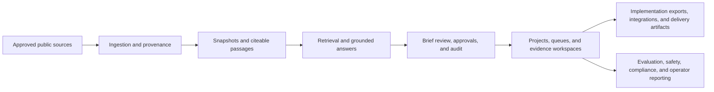

# HealthForge

HealthForge is an open-source AI engineering platform for healthcare interoperability.

It turns public regulations, implementation guides, and standards references into grounded, reviewable engineering outputs that teams can inspect, challenge, approve, and carry into downstream planning.

## Why it matters

Healthcare interoperability work usually breaks down between four steps:

- finding the right evidence
- interpreting it consistently
- getting human review and approval
- turning approved thinking into implementation-ready artifacts

HealthForge is built to close that gap without pretending an LLM should become the system of record.

## What you can do with it today

| Workflow | What HealthForge does |
| --- | --- |
| Grounded evidence search | Retrieves cited evidence from approved public-source snapshots |
| Brief creation | Turns evidence into a structured, reviewable Brief with explicit limits |
| Review and approval | Captures reviewer decisions, approvals, and audit history |
| FHIR and prior-auth planning | Supports synthetic standards lookup, validation, journey mapping, and prior-authorization analysis |
| Team workspace | Organizes work into projects, queues, assignments, saved views, and evidence collections |
| Trust and governance | Exposes evaluation, safety, compliance, and operator-readiness views |
| Implementation handoff | Prepares work-item exports, architecture guidance, solution packs, and starter artifacts |

## Current implementation snapshot

HealthForge is no longer only a retrieval demo. The current platform includes the complete evidence-to-handoff loop and the operating surfaces around it:

| Capability area | Implemented today |
| --- | --- |
| Evidence foundation | Approved-source ingestion, provenance, versioned snapshots, citeable passages, freshness signals, and source governance |
| Grounded answers | Retrieval, insufficient-evidence handling, unsupported-output safeguards, answer telemetry, and quality diagnostics |
| Engineering Briefs | Structured Brief creation, findings, citations, reviewer decisions, approvals, corrections, and immutable audit history |
| Research workspace | Projects, saved views, question packs, research notebooks, evidence collections, assignments, queues, and escalation paths |
| Interoperability planning | FHIR validation, synthetic FHIR data, standards artifacts, prior-authorization journeys, PAS/CRD/DTR planning, and implementation bundles |
| Governed delivery | Tracked work-item exports, documentation exports, collaboration notifications, inbound intake, retries, reconciliation, audit export, and delivery lineage |
| Pilot productization | Audience solution packs, workflow presets, guided onboarding paths, stakeholder reporting, pilot success checkpoints, and pilot analytics |
| Rollout governance | Production-readiness scorecards plus a controlled-rollout evidence registry with owners, statuses, evidence summaries, and next actions |
| SaaS foundation | Tenant-scoped identity, membership enforcement, administrator invitations, and hosted/private deployment boundaries |
| SaaS readiness | Unified Phase 37–40 identity, provisioning, usage, security, and launch-gate scorecard |
| Developer tooling | Platform API, CLI, JavaScript SDK, VS Code prototype, synthetic labs, and contributor documentation |

## Pilot and rollout controls

The platform now has dedicated views for teams evaluating or operating a private pilot:

- `GET /v1/pilot/readiness` — bounded private-pilot readiness checklist
- `GET /v1/pilot/solution-packs` — provider, payer, standards, workflow, and implementation entry points
- `GET /v1/pilot/analytics` — funnel, outcomes, stakeholder value evidence, feedback, and expansion score
- `GET /v1/enterprise/production-readiness` — Phases 26–30 readiness scorecards
- `GET /v1/enterprise/controlled-rollout` — Phases 31–35 execution scorecards
- `POST /v1/enterprise/controlled-rollout/evidence` — administrator-owned rollout evidence and next actions

These surfaces are designed to make gaps visible. A readiness result is not a certification, clinical validation, or guarantee that an external system completed a handoff.

## Product surfaces

| Surface | What it is for |
| --- | --- |
| Web workspace | Reviewer, approver, auditor, administrator, and demo workflows |
| Platform API | Local and bounded client-facing workflow APIs |
| VS Code prototype | Builder-side workflow exploration and implementation guidance |
| CLI | Scriptable local workflows for demos and engineering tasks |
| JavaScript SDK | Simple builder-facing integrations and examples |
| Documentation set | Demo, architecture, release-story, and operator walkthroughs |

## How the system works



## What makes HealthForge different

- Evidence stays visible instead of disappearing behind a generated answer.
- Human review is a first-class workflow, not an afterthought.
- Outputs are bounded for synthetic and non-sensitive interoperability work.
- The platform separates research, approval, and delivery so governance stays inspectable.

## What to demo in 10 minutes

1. Ask a prior-authorization or standards-planning question.
2. Show the cited findings and create a Brief.
3. Switch roles to review, approve, and inspect audit history.
4. Close with workspace, trust, and governed delivery surfaces.

Recommended prompt:

- Question: `What changes do we need for CMS prior authorization workflows?`
- Context: `Synthetic provider EHR planning scenario for prior authorization APIs.`

Additional prompts:

- Question: `How should a provider workflow handle documentation and status exchange for prior authorization?`
  Context: `Synthetic architecture review for a provider-facing utilization management workflow.`

- Question: `What evidence-quality and approval signals should an enterprise evaluator inspect?`
  Context: `Synthetic enterprise evaluation walkthrough using the HealthForge trust layer.`

## Who it is for

- interoperability product and platform teams
- healthcare architects and implementation leads
- reviewers, approvers, and auditors who need traceability
- internal champions who need a safe, credible demo
- builders who want a local-first interoperability workflow sandbox

## Capability boundaries

HealthForge is intentionally bounded today:

- public, approved, non-sensitive sources only
- synthetic or explicitly non-sensitive FHIR examples only
- human review required for recommendations and governed actions
- no PHI handling
- no claim of production certification or compliance attestation

Those boundaries are part of the product posture. They keep the system more honest, easier to evaluate, and safer to demo.

## Quick start

Prerequisites:

- Java 21+
- Maven 3.9+
- Docker Desktop

Run the local stack:

```bash
cp infra/docker/.env.example infra/docker/.env
docker compose --env-file infra/docker/.env -f infra/docker/docker-compose.yml up --build -d
```

Open:

- UI: `http://localhost:8080`
- Health: `http://localhost:8080/actuator/health`

For API-first local development:

```bash
docker compose --env-file infra/docker/.env -f infra/docker/docker-compose.yml up -d
cd apps/platform-api
mvn spring-boot:run
```

## Start here

- Want the fastest walkthrough? Read [the end-to-end demo guide](docs/36-end-to-end-demo-and-contributor-onboarding.md).
- Want a presentation-ready explanation? Read [the showcase architecture and solution narratives](docs/38-showcase-architecture-and-solution-narratives.md).
- Want a meeting-friendly story? Read [the demo and release story guide](docs/50-demo-and-release-story.md).
- Want the current product posture and next build recommendation? Read [the product readiness sweep](docs/51-product-readiness-sweep.md).
- Want the latest evidence, analyst-workspace, and governed-delivery improvements? Read [the Phase 21 evidence operations guide](docs/52-phase21-evidence-operations-and-research-quality.md), [the Phase 22 analyst research workspace guide](docs/53-phase22-analyst-research-workspace.md), and [the Phase 23 governed delivery guide](docs/54-phase23-governed-delivery-operationalization.md).
- Want the latest pilot and rollout controls? Read [the Phase 25 pilot success analytics guide](docs/55-phase25-pilot-success-and-expansion-analytics.md), [the Phases 26–30 readiness program](docs/56-phases26-30-production-readiness-program.md), and [the Phases 31–35 controlled rollout guide](docs/57-phases31-35-controlled-rollout.md).
- Want the SaaS-ready tenant boundary? Read [the Phase 36 tenant and identity hardening guide](docs/58-phase36-saas-tenant-identity-hardening.md).
- Want the SaaS launch-gate story? Read [the Phases 37–40 SaaS readiness guide](docs/59-phases37-40-saas-readiness-and-launch-gates.md).

## Documentation map

- [Platform API guide](apps/platform-api/README.md)
- [Client API surface](docs/23-client-api-surface.md)
- [End-to-end demo and contributor onboarding](docs/36-end-to-end-demo-and-contributor-onboarding.md)
- [Showcase architecture and solution narratives](docs/38-showcase-architecture-and-solution-narratives.md)
- [Demo and release story guide](docs/50-demo-and-release-story.md)
- [Product readiness sweep](docs/51-product-readiness-sweep.md)
- [Phase 21 evidence operations and research quality](docs/52-phase21-evidence-operations-and-research-quality.md)
- [Phase 22 analyst research workspace](docs/53-phase22-analyst-research-workspace.md)
- [Phase 23 governed delivery operationalization](docs/54-phase23-governed-delivery-operationalization.md)
- [Pilot readiness and solution packs](docs/44-phase15-pilot-readiness-and-solution-packs.md)
- [Phase 25 pilot success analytics](docs/55-phase25-pilot-success-and-expansion-analytics.md)
- [Phases 26–30 production-readiness program](docs/56-phases26-30-production-readiness-program.md)
- [Phases 31–35 controlled rollout execution](docs/57-phases31-35-controlled-rollout.md)
- [Phase 36 SaaS tenant and identity hardening](docs/58-phase36-saas-tenant-identity-hardening.md)
- [Phases 37–40 SaaS readiness and launch gates](docs/59-phases37-40-saas-readiness-and-launch-gates.md)
- [Deployable editions and capability boundaries](docs/37-deployable-editions-and-capability-boundaries.md)
- [Private deployment operator guide](docs/31-private-deployment-operator-guide.md)
- [VS Code extension prototype](apps/vscode-extension/README.md)
- [HealthForge CLI](apps/cli/README.md)
- [HealthForge JavaScript SDK](packages/sdk-js/README.md)
- [Release notes](docs/releases.md)

## Release notes

Detailed milestone history and release-style progress updates live in [docs/releases.md](docs/releases.md).
