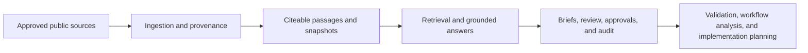

# HealthForge

HealthForge is an open-source AI engineering platform for healthcare interoperability.

It helps teams turn public regulations, implementation guides, and standards references into grounded, reviewable engineering outputs instead of disconnected notes and one-off interpretations.

## What it does

HealthForge creates a local evidence layer from approved public sources and then helps teams:

- search and retrieve cited evidence
- generate grounded answers from pinned source snapshots
- create reviewable Briefs with approvals and audit history
- inspect FHIR and standards artifacts
- validate synthetic or non-sensitive FHIR examples
- translate policy and workflow findings into implementation planning artifacts

## Why it exists

Healthcare interoperability work is rarely blocked by a lack of documents. It is usually blocked by the gap between:

- what regulations and guides say
- what engineering teams think they mean
- what reviewers are willing to approve

HealthForge is designed to reduce that gap with traceability, reviewability, and bounded outputs.

## Key capabilities

| Capability | What it helps with |
| --- | --- |
| Evidence search and grounded answers | Ask questions against a pinned corpus and get cited findings |
| Reviewable Brief workflow | Turn findings into a human-reviewed artifact with approvals and audit trail |
| FHIR validation | Validate synthetic or non-sensitive examples against pinned FHIR profiles |
| FHIR knowledge assistant | Explore curated resources, profiles, guides, and workflow touchpoints |
| Regulation explainer | Convert approved sources into plain-English technical interpretation |
| Prior-authorization workflow tools | Model journeys, review synthetic bundles, and generate standards crosswalks |
| Implementation planning export | Turn approved findings into richer payer/provider/shared implementation tracks |
| Local developer tools | Use the API, web UI, and VS Code prototype for review-driven engineering workflows |

## Product shape

HealthForge is currently a local-first platform with:

- a Spring Boot API
- a web UI
- PostgreSQL-backed evidence and review storage
- synthetic/demo-safe FHIR workflows
- approval and audit controls

It is intentionally bounded:

- public, non-sensitive sources only
- synthetic or non-sensitive FHIR examples only
- human review required for recommendations and exports
- no PHI handling
- no direct external writeback in the current product boundary

## How it works



In practice:

1. Ingest approved public source material.
2. Create citeable passages and corpus snapshots.
3. Ask a bounded engineering or workflow question.
4. Review grounded findings.
5. Approve what should become planning input.
6. Export structured artifacts for downstream engineering work.

## Quick start

Prerequisites:

- Java 21+
- Maven 3.9+
- Docker Desktop

Start the local stack:

```bash
docker compose -f infra/docker/docker-compose.yml up --build -d
```

Open:

- UI: `http://localhost:8080`
- Health: `http://localhost:8080/actuator/health`

For API-only local development:

```bash
docker compose -f infra/docker/docker-compose.yml up -d
cd apps/platform-api
mvn spring-boot:run
```

## Simple demo prompts

Try these in the local UI:

- Question: `What changes do we need for CMS prior authorization workflows?`
  Context: `Synthetic provider EHR planning scenario for prior authorization APIs.`

- Question: `What does CMS-0057-F require for prior authorization APIs?`
  Context: `Internal product planning for a non-sensitive prior authorization workflow MVP.`

- Question: `How should a provider workflow handle documentation and status exchange for prior authorization?`
  Context: `Synthetic architecture review for a provider-facing utilization management workflow.`

## Documentation

- [Platform API guide](apps/platform-api/README.md)
- [Client API surface](docs/23-client-api-surface.md)
- [FHIR knowledge assistant](docs/25-fhir-knowledge-assistant.md)
- [Regulation explainer](docs/26-regulation-explainer.md)
- [VS Code extension prototype](apps/vscode-extension/README.md)
- [Prior-authorization copilot](docs/28-prior-auth-copilot.md)
- [Tracked export integrations](docs/29-tracked-export-integrations.md)
- [Release notes](docs/releases.md)

## Release notes

Detailed delivery history, milestone progress, and release-style updates live in [docs/releases.md](docs/releases.md).
