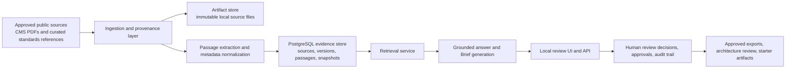

# HealthForge

An open-source AI engineering platform for healthcare interoperability.

HealthForge translates authoritative healthcare regulations and implementation guidance into traceable, reviewable engineering work: requirements, FHIR mappings, implementation plans, validation guidance, and evidence.

## Current phase

**Phase 3 completed.** HealthForge now has working application code, a local review UI, a Spring Boot API, persisted Brief review workflows, deterministic FHIR validation, standards artifact lookup, architecture-review artifacts, approved work-item export, and guarded example-only starter code generation from approved work items.

The platform remains intentionally bounded:

- public, non-sensitive sources only;
- synthetic or non-sensitive FHIR examples only;
- human review required for recommendations and exports; and
- no production PHI handling or direct external tracker writeback.

## Starting point

The first usable vertical slice is a **Regulation-to-Engineering Brief and review workflow**:

1. An authorized source document is ingested with provenance.
2. A user asks a bounded engineering question.
3. The platform returns cited findings, affected personas/capabilities, FHIR and workflow implications, and proposed work items.
4. A human reviewer accepts, corrects, or rejects each recommendation.
5. An administrator can approve the Brief and export approved work items for downstream engineering review.

This deliberately precedes code generation, automated compliance claims, and production PHI handling.

## What is implemented today

- A local Spring Boot platform API in [`apps/platform-api`](apps/platform-api/)
- Source-ingestion governance with provenance, lifecycle, and corpus snapshots
- Grounded evidence retrieval and persisted Brief generation
- Shared review identity, review decisions, approvals, and audit export
- Deterministic FHIR validation with a pinned package/profile catalog
- Standards artifact registry for base FHIR and candidate implementation-guide references
- Synthetic FHIR fixture scenarios for repeatable prior-authorization validation tests
- Architecture review assistant for bounded prior-authorization solution design
- Approved Brief work-item export for downstream engineering planning
- Guarded example-only starter code generation from approved work items
- Client-facing OpenAPI contract and local API usage guide

## Current architecture

Today’s MVP architecture is intentionally simple, local-first, and review-oriented.



In practical terms, HealthForge works like this:

1. We ingest approved public healthcare documents such as CMS rule PDFs.
2. We store the source artifact with provenance and version metadata.
3. We break documents into citeable passages and save them in a local evidence database.
4. We group eligible source versions into corpus snapshots so questions run against a known, reproducible dataset.
5. A user asks a question plus project context.
6. The platform retrieves the most relevant passages from the selected snapshot.
7. The system returns a grounded answer or creates a reviewable Brief using only cited evidence.
8. A human reviewer accepts, corrects, rejects, or approves findings before anything is treated as downstream engineering input.

This means the current system is not a generic chatbot. It is a bounded evidence-and-review platform:

- input: approved public regulatory and standards content
- processing: structured ingestion, passage extraction, indexing, and retrieval
- output: cited answers, reviewable Briefs, audit records, and approved downstream artifacts

## How users can test it

There are two easy ways to test the current MVP:

1. Use the local review UI in the browser
2. Call the API directly with curl

### Test through the local UI

Start the stack:

```bash
docker compose -f infra/docker/docker-compose.yml up --build -d
```

Then open:

- `http://localhost:8080`

Try these example questions in the UI:

1. Question:
   `What changes do we need for CMS prior authorization workflows?`

   Project context:
   `Synthetic provider EHR planning scenario for prior authorization APIs.`

   Expected result:
   - grounded evidence should be found
   - a reviewable Brief can be created
   - findings should cite CMS source passages

2. Question:
   `What does CMS-0057-F require for prior authorization APIs?`

   Project context:
   `Internal product planning for a non-sensitive prior authorization workflow MVP.`

   Expected result:
   - cited findings tied to the CMS final rule
   - Brief review and approval workflow available

3. Question:
   `How should a provider workflow handle documentation and status exchange for prior authorization?`

   Project context:
   `Synthetic architecture review for a provider-facing utilization management workflow.`

   Expected result:
   - grounded findings
   - useful inputs for architecture review and downstream planning

### Test through the API

Check health:

```bash
curl -s http://localhost:8080/actuator/health
```

Expected result:

```json
{"status":"UP","groups":["liveness","readiness"]}
```

Run grounded answer retrieval:

```bash
curl -s -X POST http://localhost:8080/v1/answers \
  -H 'Content-Type: application/json' \
  -d '{
    "corpus_id":"mvp-regulatory-corpus",
    "corpus_version":"2026-07-24-expanded-web-core-v4",
    "question":"What changes do we need for CMS prior authorization workflows?",
    "project_context":"Synthetic provider EHR planning scenario for prior authorization APIs."
  }'
```

Expected result:

- `status` should be `grounded`
- the response should include `findings`
- each finding should include a citation with source, version, and locator

Run direct retrieval search:

```bash
curl -s -X POST http://localhost:8080/v1/retrieval/search \
  -H 'Content-Type: application/json' \
  -d '{
    "corpus_id":"mvp-regulatory-corpus",
    "corpus_version":"2026-07-24-expanded-web-core-v4",
    "query":"CMS prior authorization workflow changes",
    "limit":5
  }'
```

Expected result:

- ranked retrieval results from the current corpus snapshot
- citeable excerpts from the CMS rule content

Create a reviewable Brief:

```bash
curl -s -X POST http://localhost:8080/v1/briefs \
  -H 'Content-Type: application/json' \
  -H 'X-HealthForge-Actor: local.reviewer' \
  -H 'X-HealthForge-Role: reviewer' \
  -d '{
    "corpus_id":"mvp-regulatory-corpus",
    "corpus_version":"2026-07-24-expanded-web-core-v4",
    "question":"What changes do we need for CMS prior authorization workflows?",
    "project_context":"Synthetic provider EHR planning scenario for prior authorization APIs."
  }'
```

Expected result:

- a persisted Brief with a `brief_id`
- findings, sources, summary, and audit events
- follow-up review actions available in the UI or API

## Roadmap by phase

This project is being built in deliberate phases so we can keep the platform reviewable, traceable, and safe while expanding functionality.

| Phase | Status | What this phase delivers |
| --- | --- | --- |
| Phase 1 | Completed | Problem framing, MVP scope, source-corpus definition, Brief schema, evaluation rubric, security/data boundaries, and open-source project foundations |
| Phase 2 | Completed | Executable local platform slice: corpus ingestion, snapshots, retrieval, local Brief UI, guarded Brief synthesis, review identity, approvals, audit, observability, and evaluation baselines |
| Phase 3 | Completed | Standards-aware engineering workflows: pinned FHIR validation catalog, standards artifact registry, synthetic FHIR fixtures, approved work-item export, architecture review assistant, client-facing API surface, and guarded example-only code generation |
| Phase 4 | Planned | Product growth workflows: FHIR knowledge assistant, AI regulation explainer, VS Code extension prototype, tracked GitHub/Jira-ready exports, and a prior-authorization copilot for PAS/CRD/DTR scenarios |
| Phase 5 | Planned | Enterprise and product hardening: tenant isolation, RBAC groundwork, compliance dashboard, private deployment and infrastructure-as-code, stronger audit/security controls, and synthetic FHIR data generation for safer demos and validation |

### Phase 1 completed

- MVP source corpus and support boundaries
- Electronic prior-authorization domain workflow model
- Regulation-to-Engineering Brief schema
- Evaluation set and reviewer rubric
- Knowledge ingestion, provenance, and retrieval contracts
- MVP security, data boundaries, and threat model
- Open-source governance and contributor foundations

### Phase 2 completed

- Local Brief review interface
- Immutable corpus snapshots for reproducibility
- Guarded model orchestration for structured Brief synthesis
- Retrieval and citation evaluation baseline
- Expanded approved source corpus
- Evaluation quality gates and regression baselines
- Shared-review identity, roles, approvals, and audit records
- Deployment configuration and operational observability
- FHIR validation workspace prototype
- Source lifecycle governance and terms-review metadata

### Phase 3 completed

- pinned FHIR validation package and catalog workflow
- standards artifact registry
- synthetic FHIR fixtures and evaluator scenarios
- approved Brief work-item export
- architecture review assistant
- client-facing API surface
- guarded example-only code generation from approved work items

### Phase 4 planned

- FHIR knowledge assistant over curated standards artifacts
- AI regulation explainer workflow
- VS Code extension prototype for local workflows
- Tracked export integrations for GitHub and Jira-ready work items
- Prior-authorization copilot workflow for PAS/CRD/DTR scenarios

### Phase 5 planned

- Tenant isolation and organization boundaries
- Enterprise RBAC groundwork
- Compliance dashboard foundation
- Private deployment and infrastructure-as-code
- Stronger security, audit export, and evidence-retention controls
- Synthetic FHIR data generator for safe demos and validation workflows

### Community and adoption roadmap

- Publish a non-sensitive end-to-end demo and contributor onboarding path
- Establish a repeatable technical content and community growth pipeline

## Core local workflows

Today the repo supports these main local workflows:

1. Ingest approved public source material and pin it into a controlled corpus.
2. Ask a bounded engineering question and generate a cited Brief draft.
3. Review, correct, approve, and audit that Brief through the local workflow.
4. Export approved implementation work items for downstream planning.
5. Validate synthetic FHIR examples against a pinned validation catalog.
6. Review architecture implications for prior-authorization scenarios using grounded evidence plus curated standards touchpoints.

## Documentation

- [`docs/01-problem-and-product-scope.md`](docs/01-problem-and-product-scope.md)
- [`docs/02-target-architecture.md`](docs/02-target-architecture.md)
- [`docs/03-repository-structure.md`](docs/03-repository-structure.md)
- [`docs/04-first-90-days.md`](docs/04-first-90-days.md)
- [`docs/05-decision-log.md`](docs/05-decision-log.md)
- [`docs/06-mvp-source-corpus.md`](docs/06-mvp-source-corpus.md)
- [`docs/07-electronic-prior-authorization-workflow.md`](docs/07-electronic-prior-authorization-workflow.md)
- [`docs/08-regulation-to-engineering-brief-contract.md`](docs/08-regulation-to-engineering-brief-contract.md)
- [`docs/09-evaluation-and-review-rubric.md`](docs/09-evaluation-and-review-rubric.md)
- [`docs/10-ingestion-provenance-and-retrieval-contract.md`](docs/10-ingestion-provenance-and-retrieval-contract.md)
- [`docs/12-persisted-brief-review.md`](docs/12-persisted-brief-review.md)
- [`docs/20-fhir-validation-workspace.md`](docs/20-fhir-validation-workspace.md)
- [`docs/21-brief-work-item-export.md`](docs/21-brief-work-item-export.md)
- [`docs/22-architecture-review-assistant.md`](docs/22-architecture-review-assistant.md)
- [`docs/23-client-api-surface.md`](docs/23-client-api-surface.md)
- [`knowledge/manifests/mvp-source-corpus.yaml`](knowledge/manifests/mvp-source-corpus.yaml)
- [`knowledge/fixtures/regulation-to-engineering-brief.example.json`](knowledge/fixtures/regulation-to-engineering-brief.example.json)
- [`knowledge/fixtures/fhir-validation/README.md`](knowledge/fixtures/fhir-validation/README.md)
- [`packages/contracts/regulation-to-engineering-brief.schema.json`](packages/contracts/regulation-to-engineering-brief.schema.json)
- [`packages/contracts/knowledge-ingestion-retrieval.openapi.yaml`](packages/contracts/knowledge-ingestion-retrieval.openapi.yaml)
- [`evals/datasets/cms-0057-f-mvp-evaluation-cases.json`](evals/datasets/cms-0057-f-mvp-evaluation-cases.json)
- [`evals/datasets/fhir-validation/prior-authorization-scenarios.json`](evals/datasets/fhir-validation/prior-authorization-scenarios.json)

## Local platform surface

The main executable vertical slice lives in [`apps/platform-api`](apps/platform-api/). It provides:

- ingestion and provenance endpoints;
- grounded retrieval and Brief workflows;
- review, approval, audit, and work-item export endpoints;
- standards artifact lookup;
- architecture review generation; and
- deterministic FHIR validation endpoints.

See the local setup guide in [apps/platform-api/README.md](apps/platform-api/README.md).

## Evaluation

Run [`scripts/evaluate-retrieval.sh`](scripts/evaluate-retrieval.sh) against a pinned local corpus snapshot to produce retrieval-recall and citation-coverage baseline reports.

Synthetic FHIR validation scenarios are available under [`evals/datasets/fhir-validation`](evals/datasets/fhir-validation).
