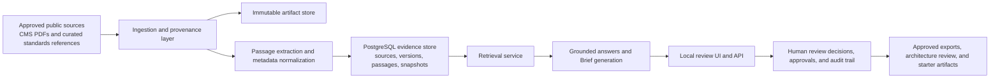

# HealthForge

HealthForge is an open-source AI engineering platform for healthcare interoperability.

It helps healthcare teams turn authoritative public regulations, implementation guides, and standards artifacts into traceable engineering outputs: grounded answers, reviewable Briefs, architecture guidance, validation results, and implementation-ready artifacts.

In practical terms, HealthForge creates a local evidence layer from approved public sources, then gives reviewers, approvers, auditors, and administrators a structured way to search, assess, validate, approve, and export what the platform finds.

## Features

| Capability | Interface | What it does | Status |
| --- | --- | --- | --- |
| Regulatory document ingestion | Backend workflow | Ingests approved public documents such as CMS PDFs and stores provenance, versions, and artifacts locally | Available now |
| Evidence extraction and corpus snapshots | Backend workflow | Splits documents into citeable passages and organizes them into reproducible corpus snapshots | Available now |
| Web-based evidence search and grounded answers | Web UI + API | Lets users ask questions with project context and returns grounded answers backed by retrieved evidence | Available now |
| Reviewable Brief workflow | Web UI + API | Creates Briefs with findings, citations, review decisions, approvals, and audit history | Available now |
| Role-aware review console | Web UI | Adapts the console to reviewer, approver, auditor, and administrator responsibilities so users only see or trigger actions appropriate for their role | Available now |
| Tenant-aware review boundaries | Web UI + API | Scopes Briefs, exports, telemetry, and admin directory access to the active organization | Available now |
| FHIR validation | API + VS Code prototype | Validates synthetic or non-sensitive FHIR examples against a pinned R4 validation catalog | Available now |
| FHIR knowledge assistant | API + VS Code prototype | Helps developers inspect curated FHIR resources, profiles, guides, and workflow touchpoints | Available now |
| Regulation explainer | API | Turns an approved source into a plain-English technical explainer with citations, caveats, and implications | Available now |
| Prior-authorization copilot | API | Analyzes PAS, CRD, and DTR-oriented workflow scenarios with evidence and standards touchpoints | Available now |
| Prior-authorization journey modeling | API | Renders PAS, CRD, and DTR workflow journeys with explicit stages, transitions, responsibilities, and candidate standards touchpoints | Available now |
| Tracked export previews | API | Generates GitHub- and Jira-ready preview payloads from approved work items without direct writeback, with approver/admin authorization and audit traceability | Available now |
| Architecture review assistant | API | Produces bounded architecture guidance from grounded evidence and curated standards metadata | Available now |
| Guarded starter artifacts | API | Generates example-only starter code from approved work-item exports | Available now |
| VS Code extension prototype | VS Code | Brings Brief creation, FHIR validation, and standards lookup into the developer workflow | Prototype available now |
| Identity directory and access model | API | Persists durable users, organizations, memberships, and role assignments behind a pluggable auth boundary | Available now |
| Additional developer and enterprise integrations | Web UI + API + private deployment scaffolding | Broader enterprise workflows including compliance visibility, synthetic FHIR generators, private deployment scaffolding, and stronger audit/export controls | Available now |

## Quick start

Prerequisites:

- Java 21+
- Maven 3.9+
- Docker Desktop

Start the full local stack:

```bash
docker compose -f infra/docker/docker-compose.yml up --build -d
```

Open the app:

- UI: `http://localhost:8080`
- Health: `http://localhost:8080/actuator/health`

If you want the API-only local dev loop:

```bash
docker compose -f infra/docker/docker-compose.yml up -d
cd apps/platform-api
mvn spring-boot:run
```

## Current status

Phase 5 is completed. Phase 6 is completed.

The working platform includes:

- a local review UI
- a Spring Boot API
- PostgreSQL-backed evidence storage
- persisted Brief review workflows
- deterministic FHIR validation
- standards artifact lookup
- FHIR knowledge assistant workflow
- regulation explainer workflow
- prior-authorization copilot workflow
- tracked GitHub/Jira-ready export previews
- architecture-review artifacts
- approved work-item export
- guarded example-only starter code generation
- a local VS Code extension prototype
- organization-aware review boundaries
- compliance dashboard and enterprise posture APIs
- synthetic FHIR generator APIs
- private deployment Terraform starter scaffolding
- durable user, organization, membership, and role-assignment modeling
- a pluggable authentication boundary for future identity providers
- tenant-scoped identity directory inspection for administrators
- role-aware UI controls across reviewer, approver, auditor, and administrator flows
- RBAC enforcement aligned across the UI and core APIs

The MVP is intentionally bounded:

- public, non-sensitive sources only
- synthetic or non-sensitive FHIR examples only
- human review required for recommendations and exports
- no production PHI handling
- no direct external system writeback in the MVP

## Showcase

The first usable vertical slice is the Regulation-to-Engineering Brief workflow:

1. Ingest an approved public source document with provenance.
2. Ask a bounded engineering or workflow question.
3. Retrieve grounded evidence from a pinned corpus snapshot.
4. Create a reviewable Brief from cited findings.
5. Accept, correct, reject, and approve findings through a human review workflow.
6. Export approved implementation work items for downstream engineering planning.

The platform is now also strong enough to demo an enterprise review story:

1. Switch roles in the local review console.
2. Show how reviewer, approver, auditor, and administrator actions differ.
3. Demonstrate that organization-scoped reads, approvals, exports, and admin inspection stay tenant-aware.
4. Walk from evidence discovery to approval to export preview without direct external writeback.

## Examples

There are two simple ways to test the MVP.

### 1. Test through the local UI

Open `http://localhost:8080` and try one of these:

Example 1

- Question: `What changes do we need for CMS prior authorization workflows?`
- Project context: `Synthetic provider EHR planning scenario for prior authorization APIs.`

Expected outcome:

- grounded evidence is found
- a reviewable Brief can be created
- findings include citations to CMS source passages

Example 2

- Question: `What does CMS-0057-F require for prior authorization APIs?`
- Project context: `Internal product planning for a non-sensitive prior authorization workflow MVP.`

Expected outcome:

- findings are tied to the CMS final rule
- the review and approval workflow is available

Example 3

- Question: `How should a provider workflow handle documentation and status exchange for prior authorization?`
- Project context: `Synthetic architecture review for a provider-facing utilization management workflow.`

Expected outcome:

- grounded findings are returned
- the result is useful as architecture-review input

### 2. Test through the API

Health check:

```bash
curl -s http://localhost:8080/actuator/health
```

Expected result:

```json
{"status":"UP","groups":["liveness","readiness"]}
```

Grounded answer:

```bash
curl -s -X POST http://localhost:8080/v1/answers \
  -H 'Content-Type: application/json' \
  -d '{
    "corpus_id":"mvp-regulatory-corpus",
    "corpus_version":"2026-07-24-expanded-web-core-v4",
    "question":"What changes do we need for CMS prior authorization workflows?",
    "project_context":"Synthetic provider EHR planning scenario for prior authorization APIs."
  }'
```

Expected result:

- `status` is `grounded`
- the response includes `findings`
- each finding includes source/version/locator citation data

Direct retrieval search:

```bash
curl -s -X POST http://localhost:8080/v1/retrieval/search \
  -H 'Content-Type: application/json' \
  -d '{
    "corpus_id":"mvp-regulatory-corpus",
    "corpus_version":"2026-07-24-expanded-web-core-v4",
    "query":"CMS prior authorization workflow changes",
    "limit":5
  }'
```

Create a reviewable Brief:

```bash
curl -s -X POST http://localhost:8080/v1/briefs \
  -H 'Content-Type: application/json' \
  -H 'X-HealthForge-Actor: local.reviewer' \
  -H 'X-HealthForge-Role: reviewer' \
  -d '{
    "corpus_id":"mvp-regulatory-corpus",
    "corpus_version":"2026-07-24-expanded-web-core-v4",
    "question":"What changes do we need for CMS prior authorization workflows?",
    "project_context":"Synthetic provider EHR planning scenario for prior authorization APIs."
  }'
```

Expected result:

- a persisted `brief_id`
- findings, sources, summary, and audit events
- follow-up review actions available through the UI and API

## Links

- [Platform API guide](apps/platform-api/README.md)
- [Client API surface](docs/23-client-api-surface.md)
- [FHIR knowledge assistant](docs/25-fhir-knowledge-assistant.md)
- [Regulation explainer](docs/26-regulation-explainer.md)
- [VS Code extension prototype](apps/vscode-extension/README.md)
- [Prior-authorization copilot](docs/28-prior-auth-copilot.md)
- [Tracked export integrations](docs/29-tracked-export-integrations.md)

## Current architecture

The MVP architecture is intentionally simple, local-first, and review-oriented.



In practice, the system works like this:

1. Approved public source documents are ingested.
2. Source artifacts and provenance metadata are persisted.
3. Documents are split into citeable passages.
4. Passages are stored in a structured evidence database.
5. Eligible source versions are grouped into corpus snapshots.
6. A user submits a question and project context.
7. Relevant evidence is retrieved from the selected snapshot.
8. The platform returns a grounded answer or creates a reviewable Brief.
9. Human reviewers decide what is accepted, corrected, rejected, or approved.

## Tech specs

The current MVP uses a deliberately small, inspectable stack.

| Area | Current spec |
| --- | --- |
| Primary backend | Java 21 |
| Framework | Spring Boot 3.5.16 |
| Build tool | Maven 3.9+ |
| API style | REST JSON API |
| UI | Server-hosted local HTML/CSS/JavaScript review UI |
| Database | PostgreSQL 17 |
| Database access | Spring JDBC |
| Migrations | Flyway |
| Document parsing | Apache PDFBox 3.0.8 |
| FHIR library | HAPI FHIR R4 8.10.0 |
| Validation scope | Deterministic FHIR R4 validation for synthetic or non-sensitive examples |
| Search | PostgreSQL full-text retrieval over citeable passages |
| Packaging | Spring Boot executable jar + Docker container |
| Local orchestration | Docker Compose |
| Observability | Spring Boot Actuator health/readiness/liveness/metrics |
| Auth model in MVP | Lightweight actor headers for reviewer/administrator identity |
| Deployment target today | Local machine / local Docker environment |

Runtime footprint:

- `apps/platform-api` contains the main executable application
- `infra/docker/docker-compose.yml` runs:
  - `postgres:17-alpine`
  - the `platform-api` container
- API default port: `8080`
- local PostgreSQL host port: `5433`

Data and interface shape:

- input documents: approved public PDFs and curated standards references
- stored units:
  - source artifacts
  - source versions
  - passages
  - corpus snapshots
  - Briefs
  - review decisions
  - approvals
  - audit events
- primary outputs:
  - retrieval results
  - grounded answers
  - persisted Briefs
  - approved work-item exports
  - architecture review artifacts
  - starter code artifacts
  - FHIR validation results

Technical boundaries:

- no PHI or production clinical data handling
- no direct production EHR integration
- no autonomous compliance determination
- no direct writeback to Jira, GitHub issues, or payer/provider systems in the MVP
- all downstream engineering outputs remain human-review gated

## Core local workflows

Today the repo supports these main workflows:

1. Ingest approved public source material into a controlled corpus.
2. Ask a bounded engineering question and generate a cited Brief draft.
3. Review, correct, approve, and audit the Brief.
4. Export approved implementation work items for downstream planning.
5. Validate synthetic FHIR examples against a pinned validation catalog.
6. Review architecture implications for prior-authorization scenarios using grounded evidence plus curated standards touchpoints.

## Local platform surface

The main executable vertical slice lives in [`apps/platform-api`](apps/platform-api/).

It provides:

- ingestion and provenance endpoints
- grounded retrieval and Brief workflows
- review, approval, audit, and work-item export endpoints
- standards artifact lookup
- architecture review generation
- deterministic FHIR validation endpoints

See the local setup guide in [apps/platform-api/README.md](apps/platform-api/README.md).

## Roadmap

HealthForge is being built in deliberate phases so the platform stays reviewable, traceable, and safe while expanding functionality.

| Phase | Status | What this phase delivers |
| --- | --- | --- |
| Phase 1 | Completed | Problem framing, MVP scope, source-corpus definition, Brief schema, evaluation rubric, security/data boundaries, and open-source project foundations |
| Phase 2 | Completed | Executable local platform slice: corpus ingestion, snapshots, retrieval, local Brief UI, guarded Brief synthesis, review identity, approvals, audit, observability, and evaluation baselines |
| Phase 3 | Completed | Standards-aware engineering workflows: pinned FHIR validation catalog, standards artifact registry, synthetic FHIR fixtures, approved work-item export, architecture review assistant, client-facing API surface, and guarded example-only code generation |
| Phase 4 | Completed | Product growth workflows: FHIR knowledge assistant, regulation explainer, VS Code extension prototype, tracked GitHub/Jira-ready export previews, and a prior-authorization copilot for PAS/CRD/DTR scenarios |
| Phase 5 | Completed | Enterprise and product hardening: organization-aware review boundaries, RBAC groundwork, compliance dashboard, private deployment and infrastructure-as-code starter scaffolding, stronger audit/security controls, and synthetic FHIR data generation for safer demos and validation |
| Phase 6 | Completed | Production identity, RBAC, tenant administration, and stronger enterprise access controls. Authentication boundary, durable identity model, RBAC enforcement, private deployment hardening, and audit/access-review reporting are complete. See [#88](https://github.com/venkata-ramana/HealthForge/issues/88). |
| Phase 7 | In progress | Deeper prior-authorization and interoperability workflows including PAS/CRD/DTR journeys, bundle review, and standards crosswalks. Journey modeling is complete. See [#89](https://github.com/venkata-ramana/HealthForge/issues/89). |
| Phase 8 | Planned | Enterprise integrations and delivery automation including governed writeback, collaboration notifications, and webhooks. See [#90](https://github.com/venkata-ramana/HealthForge/issues/90). |
| Phase 9 | Planned | Trust, evaluation, and governance at scale with dashboards, regression visibility, and policy reporting. See [#91](https://github.com/venkata-ramana/HealthForge/issues/91). |
| Phase 10 | Planned | Productization, onboarding, showcase UX, and admin experiences for broader adoption. See [#92](https://github.com/venkata-ramana/HealthForge/issues/92). |

### Phase highlights

Phase 1 completed:

- MVP source corpus and support boundaries
- prior-authorization workflow model
- Regulation-to-Engineering Brief schema
- evaluation set and reviewer rubric
- ingestion, provenance, and retrieval contracts
- security boundaries and threat model
- open-source project foundations

Phase 2 completed:

- local Brief review interface
- immutable corpus snapshots
- guarded Brief synthesis
- retrieval and citation evaluation baseline
- expanded approved source corpus
- evaluation quality gates and regression baselines
- shared review identity, roles, approvals, and audit records
- deployment configuration and operational observability
- FHIR validation workspace prototype
- source lifecycle governance and terms-review metadata

Phase 3 completed:

- pinned FHIR validation package and catalog workflow
- standards artifact registry
- synthetic FHIR fixtures and evaluator scenarios
- approved Brief work-item export
- architecture review assistant
- client-facing API surface
- guarded example-only code generation from approved work items

Phase 4 completed:

- FHIR knowledge assistant over curated standards artifacts
- regulation explainer workflow over approved corpus sources
- local VS Code extension prototype
- tracked GitHub- and Jira-ready export preview integration
- prior-authorization copilot workflow for PAS/CRD/DTR scenarios

Phase 5 completed:

- organization-aware Brief, approval, validation, and export telemetry boundaries
- approver and auditor role groundwork in addition to reviewer and administrator flows
- compliance dashboard API for enterprise oversight
- enterprise posture API for private deployment control inspection
- persisted validation-run telemetry for synthetic/non-sensitive FHIR validation
- synthetic FHIR generator API backed by repository fixtures
- bundle-level prior-authorization scenario review over synthetic multi-resource FHIR bundles
- private deployment Terraform starter scaffolding
- stronger export retention metadata and audit coverage

Phase 6 completed:

- completed: production-oriented authentication boundary beyond direct controller coupling
- completed: durable user, organization, membership, and role-assignment models
- completed: RBAC and tenant-aware authorization across UI and APIs
- completed: stronger operator setup, secret handling, and private deployment hardening
- completed: audit policy configuration and access-review reporting

Phase 7 in progress:

- completed: PAS, CRD, and DTR workflow journeys with explicit state transitions
- completed: bundle-level scenario review for prior-authorization exchanges
- next: standards crosswalks from CMS requirements to FHIR and workflow touchpoints
- next: richer payer/provider implementation tracks from approved Briefs

Phase 8 planned:

- governed GitHub and Jira writeback flows with approval gates
- collaboration notifications and workflow handoffs
- documentation-system export targets for approved artifacts
- event and webhook automation framework
- improved private deployment promotion and environment automation

Phase 9 planned:

- evaluation dashboard for retrieval, citation, and workflow quality
- source freshness, evidence coverage, and unsupported-output risk tracking
- reviewer disagreement and decision-consistency analytics
- policy and safety reporting for enterprise oversight
- broader regression suites for workflow and artifact quality

Phase 10 planned:

- polished multi-workflow product UX
- guided onboarding, sandbox mode, and repeatable demo flows
- deployable product packaging and clearer capability boundaries
- showcase architecture, solution narratives, and testing paths
- admin console experience for operators and enterprise evaluators

### Planned backlog by phase

- Phase 6 roadmap: [#88](https://github.com/venkata-ramana/HealthForge/issues/88)
  - [#93](https://github.com/venkata-ramana/HealthForge/issues/93) authentication boundary — completed
  - [#94](https://github.com/venkata-ramana/HealthForge/issues/94) user/org/membership model — completed
  - [#95](https://github.com/venkata-ramana/HealthForge/issues/95) RBAC and tenant-aware authorization — completed
  - [#96](https://github.com/venkata-ramana/HealthForge/issues/96) private deployment hardening — completed
  - [#97](https://github.com/venkata-ramana/HealthForge/issues/97) audit policy and access-review reporting — completed

- Phase 7 roadmap: [#89](https://github.com/venkata-ramana/HealthForge/issues/89)
  - [#98](https://github.com/venkata-ramana/HealthForge/issues/98) PAS/CRD/DTR workflow journeys — completed
  - [#99](https://github.com/venkata-ramana/HealthForge/issues/99) bundle-level scenario review — completed
  - [#100](https://github.com/venkata-ramana/HealthForge/issues/100) standards crosswalk generation
  - [#101](https://github.com/venkata-ramana/HealthForge/issues/101) payer/provider implementation tracks

- Phase 8 roadmap: [#90](https://github.com/venkata-ramana/HealthForge/issues/90)
  - [#102](https://github.com/venkata-ramana/HealthForge/issues/102) governed GitHub/Jira writeback
  - [#103](https://github.com/venkata-ramana/HealthForge/issues/103) collaboration notifications and handoffs
  - [#104](https://github.com/venkata-ramana/HealthForge/issues/104) documentation-system exports
  - [#105](https://github.com/venkata-ramana/HealthForge/issues/105) event and webhook framework
  - [#106](https://github.com/venkata-ramana/HealthForge/issues/106) environment promotion automation

- Phase 9 roadmap: [#91](https://github.com/venkata-ramana/HealthForge/issues/91)
  - [#107](https://github.com/venkata-ramana/HealthForge/issues/107) evaluation dashboard
  - [#108](https://github.com/venkata-ramana/HealthForge/issues/108) freshness and evidence coverage tracking
  - [#109](https://github.com/venkata-ramana/HealthForge/issues/109) reviewer disagreement analytics
  - [#110](https://github.com/venkata-ramana/HealthForge/issues/110) policy and safety reporting
  - [#111](https://github.com/venkata-ramana/HealthForge/issues/111) broader regression suites

- Phase 10 roadmap: [#92](https://github.com/venkata-ramana/HealthForge/issues/92)
  - [#112](https://github.com/venkata-ramana/HealthForge/issues/112) polished product UX
  - [#113](https://github.com/venkata-ramana/HealthForge/issues/113) onboarding and sandbox mode
  - [#114](https://github.com/venkata-ramana/HealthForge/issues/114) deployable editions and packaging
  - [#115](https://github.com/venkata-ramana/HealthForge/issues/115) showcase architecture and testing paths
  - [#116](https://github.com/venkata-ramana/HealthForge/issues/116) admin console experience

## Documentation map

Core docs:

- [`docs/01-problem-and-product-scope.md`](docs/01-problem-and-product-scope.md)
- [`docs/02-target-architecture.md`](docs/02-target-architecture.md)
- [`docs/03-repository-structure.md`](docs/03-repository-structure.md)
- [`docs/04-first-90-days.md`](docs/04-first-90-days.md)
- [`docs/05-decision-log.md`](docs/05-decision-log.md)

Workflow and domain docs:

- [`docs/06-mvp-source-corpus.md`](docs/06-mvp-source-corpus.md)
- [`docs/07-electronic-prior-authorization-workflow.md`](docs/07-electronic-prior-authorization-workflow.md)
- [`docs/08-regulation-to-engineering-brief-contract.md`](docs/08-regulation-to-engineering-brief-contract.md)
- [`docs/09-evaluation-and-review-rubric.md`](docs/09-evaluation-and-review-rubric.md)
- [`docs/10-ingestion-provenance-and-retrieval-contract.md`](docs/10-ingestion-provenance-and-retrieval-contract.md)
- [`docs/12-persisted-brief-review.md`](docs/12-persisted-brief-review.md)
- [`docs/20-fhir-validation-workspace.md`](docs/20-fhir-validation-workspace.md)
- [`docs/21-brief-work-item-export.md`](docs/21-brief-work-item-export.md)
- [`docs/22-architecture-review-assistant.md`](docs/22-architecture-review-assistant.md)
- [`docs/23-client-api-surface.md`](docs/23-client-api-surface.md)
- [`docs/25-fhir-knowledge-assistant.md`](docs/25-fhir-knowledge-assistant.md)
- [`docs/26-regulation-explainer.md`](docs/26-regulation-explainer.md)
- [`docs/27-vscode-extension-prototype.md`](docs/27-vscode-extension-prototype.md)
- [`docs/28-prior-auth-copilot.md`](docs/28-prior-auth-copilot.md)
- [`docs/29-tracked-export-integrations.md`](docs/29-tracked-export-integrations.md)
- [`docs/30-phase-5-enterprise-hardening.md`](docs/30-phase-5-enterprise-hardening.md)
- [`docs/31-private-deployment-operator-guide.md`](docs/31-private-deployment-operator-guide.md)

Reference artifacts:

- [`knowledge/manifests/mvp-source-corpus.yaml`](knowledge/manifests/mvp-source-corpus.yaml)
- [`knowledge/fixtures/regulation-to-engineering-brief.example.json`](knowledge/fixtures/regulation-to-engineering-brief.example.json)
- [`knowledge/fixtures/fhir-validation/README.md`](knowledge/fixtures/fhir-validation/README.md)
- [`packages/contracts/regulation-to-engineering-brief.schema.json`](packages/contracts/regulation-to-engineering-brief.schema.json)
- [`packages/contracts/knowledge-ingestion-retrieval.openapi.yaml`](packages/contracts/knowledge-ingestion-retrieval.openapi.yaml)
- [`evals/datasets/cms-0057-f-mvp-evaluation-cases.json`](evals/datasets/cms-0057-f-mvp-evaluation-cases.json)
- [`evals/datasets/fhir-validation/prior-authorization-scenarios.json`](evals/datasets/fhir-validation/prior-authorization-scenarios.json)

Developer tooling:

- [`apps/vscode-extension/README.md`](apps/vscode-extension/README.md)

## Evaluation

Run [`scripts/evaluate-retrieval.sh`](scripts/evaluate-retrieval.sh) against a pinned local corpus snapshot to produce retrieval-recall and citation-coverage baseline reports.

Synthetic FHIR validation scenarios are available under [`evals/datasets/fhir-validation`](evals/datasets/fhir-validation).

## Community and adoption

Near-term community goals:

- publish a non-sensitive end-to-end demo and contributor onboarding path
- establish a repeatable technical content and community growth pipeline
