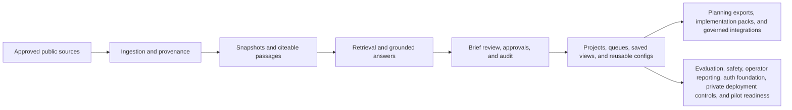

# HealthForge

HealthForge is an open-source AI engineering platform for healthcare interoperability.

It helps teams turn public regulations, implementation guides, and standards references into grounded, reviewable engineering outputs instead of disconnected notes, unsupported interpretations, and one-off planning artifacts.

## What it is

HealthForge creates a local evidence layer from approved public sources and then helps teams:

- retrieve cited evidence from pinned snapshots
- generate grounded answers with explicit limits
- create reviewable Briefs with approvals and audit history
- inspect workflow, standards, and FHIR planning artifacts
- evaluate trust, safety, and workflow quality over time
- prepare governed downstream delivery artifacts for engineering and operator teams

## Why it exists

Healthcare interoperability work is rarely blocked by missing documents.

It is usually blocked by the gap between:

- what regulations and implementation guides say
- what engineering teams think they mean
- what reviewers and approvers are willing to sign off on
- what operators can safely demonstrate or govern

HealthForge is designed to reduce that gap with traceability, reviewability, bounded outputs, and operator-visible trust signals.

## Product highlights

| Area | What it helps with |
| --- | --- |
| Grounded evidence | Ask bounded questions against pinned source snapshots and inspect cited findings |
| Brief workflow | Turn grounded findings into human-reviewed artifacts with decisions, approvals, and audit trail |
| Team workspace | Organize briefs into projects, reviewer queues, assignments, saved views, and evidence workspaces |
| FHIR and workflow tooling | Explore standards, validate synthetic examples, review bundles, and inspect prior-auth planning paths |
| Governed delivery | Prepare tracker, collaboration, documentation, webhook, and inbound-case workflows with explicit controls and receipts |
| Trust, evaluation, intelligence, operations, pilots, implementation acceleration, and synthetic labs | Inspect quality gates, evidence sufficiency, disagreement patterns, policy/safety reporting, enterprise auth posture, bounded recommendations, private-deployment operator controls, pilot-readiness assets, implementation-ready handoff packs, and synthetic workflow labs |
| Showcase and builder UX | Use the web workspace, API, docs, VS Code companion, CLI, and starter SDK for demo-safe workflows |

## How it works



## Capability boundaries

HealthForge is intentionally bounded today:

- public, non-sensitive sources only
- synthetic or non-sensitive FHIR examples only
- human review required for recommendations and governed downstream actions
- no PHI handling
- no claim of compliance certification or production-readiness

Those boundaries are a feature, not a missing disclaimer: they make the product easier to trust and easier to demo honestly.

## Quick start

Prerequisites:

- Java 21+
- Maven 3.9+
- Docker Desktop

Start the local stack:

```bash
docker compose -f infra/docker/docker-compose.yml up --build -d
```

Open:

- UI: `http://localhost:8080`
- Health: `http://localhost:8080/actuator/health`

For API-only local development:

```bash
docker compose -f infra/docker/docker-compose.yml up -d
cd apps/platform-api
mvn spring-boot:run
```

## Best demo prompts

Try these in the local UI:

- Question: `What changes do we need for CMS prior authorization workflows?`
  Context: `Synthetic provider EHR planning scenario for prior authorization APIs.`

- Question: `How should a provider workflow handle documentation and status exchange for prior authorization?`
  Context: `Synthetic architecture review for a provider-facing utilization management workflow.`

- Question: `What evidence-quality and approval signals should an enterprise evaluator inspect?`
  Context: `Synthetic enterprise evaluation walkthrough using the HealthForge trust layer.`

## Choose your path

- Want to understand the product quickly? Start with [the end-to-end demo and onboarding guide](docs/36-end-to-end-demo-and-contributor-onboarding.md).
- Want the supported API boundary? Read [the client API surface](docs/23-client-api-surface.md).
- Want the operator story? Read [the private deployment operator guide](docs/31-private-deployment-operator-guide.md).
- Want the team workspace story? Read [the Phase 11 collaboration workspace guide](docs/40-phase11-team-workspaces-and-auth-foundation.md).
- Want the governed connector story? Read [the Phase 12 integrations and orchestration guide](docs/41-phase12-governed-integrations-and-orchestration.md).
- Want the recommendation story? Read [the Phase 13 intelligence loops guide](docs/42-phase13-intelligence-loops-and-recommendations.md).
- Want the private deployment operations story? Read [the Phase 14 enterprise operations guide](docs/43-phase14-private-deployment-and-enterprise-operations.md).
- Want the pilot-readiness story? Read [the Phase 15 pilot readiness and solution packs guide](docs/44-phase15-pilot-readiness-and-solution-packs.md).
- Want the implementation acceleration story? Read [the Phase 16 implementation acceleration guide](docs/45-phase16-implementation-acceleration.md).
- Want the synthetic testing story? Read [the Phase 17 synthetic interoperability labs guide](docs/46-phase17-synthetic-interoperability-labs.md).
- Want the builder workflow story? Read [the Phase 18 developer workflows guide](docs/47-phase18-developer-workflows.md).
- Want the trust layer? Read [Phase 9 evaluation and trust](docs/34-phase-9-evaluation-and-trust.md).
- Want the packaging story? Read [deployable editions and capability boundaries](docs/37-deployable-editions-and-capability-boundaries.md).

## Documentation

- [Platform API guide](apps/platform-api/README.md)
- [Client API surface](docs/23-client-api-surface.md)
- [End-to-end demo and contributor onboarding](docs/36-end-to-end-demo-and-contributor-onboarding.md)
- [Showcase architecture and solution narratives](docs/38-showcase-architecture-and-solution-narratives.md)
- [Phase 11 collaboration workspace and auth foundation](docs/40-phase11-team-workspaces-and-auth-foundation.md)
- [Phase 12 governed integrations and orchestration](docs/41-phase12-governed-integrations-and-orchestration.md)
- [Phase 13 intelligence loops and recommendations](docs/42-phase13-intelligence-loops-and-recommendations.md)
- [Phase 14 private deployment and enterprise operations](docs/43-phase14-private-deployment-and-enterprise-operations.md)
- [Phase 15 pilot readiness and solution packs](docs/44-phase15-pilot-readiness-and-solution-packs.md)
- [Phase 16 implementation acceleration](docs/45-phase16-implementation-acceleration.md)
- [Phase 17 synthetic interoperability labs](docs/46-phase17-synthetic-interoperability-labs.md)
- [Phase 18 developer workflows](docs/47-phase18-developer-workflows.md)
- [Deployable editions and capability boundaries](docs/37-deployable-editions-and-capability-boundaries.md)
- [Content and community pipeline](docs/39-content-and-community-pipeline.md)
- [VS Code extension prototype](apps/vscode-extension/README.md)
- [HealthForge CLI](apps/cli/README.md)
- [HealthForge JavaScript SDK](packages/sdk-js/README.md)
- [Release notes](docs/releases.md)

## Release notes

Detailed delivery history, milestone progress, and release-style updates live in [docs/releases.md](docs/releases.md).
