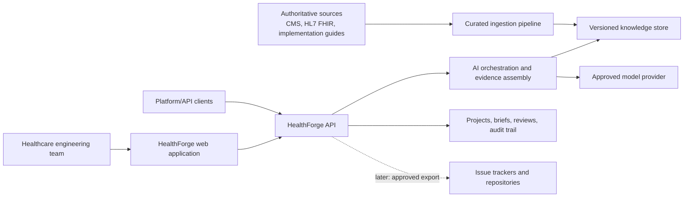
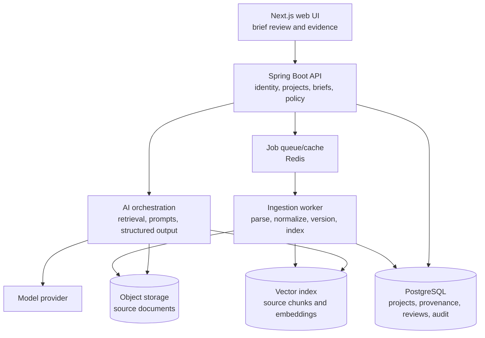

# Target architecture

## Architectural stance

Build a modular monolith first: one deployable application with clear internal module boundaries and independently deployable infrastructure services where warranted. This avoids premature distributed-system complexity while preserving a path to separate services later.

The platform must separate authoritative content, retrieval, AI orchestration, domain rules, and human decisions. An LLM may synthesize and propose; it must not be the system of record for regulations, standards mappings, or approvals.

## Context diagram

## MVP container view

## Core domain objects

| Object | Purpose |
| --- | --- |
| SourceDocument / SourceVersion | Original authoritative artifact plus origin, effective dates, checksum, license, and ingestion metadata |
| SourcePassage | A stable citeable excerpt with page/section locator |
| StandardArtifact | FHIR resource, profile, value set, operation, or implementation-guide reference |
| Project | A customer's isolated engineering context and selected supported corpus |
| EngineeringBrief | The generated, versioned technical-impact output |
| Finding | A claim, recommendation, uncertainty, or requirement; linked to passages |
| ReviewDecision | Human acceptance/rejection/correction of a finding |
| EvidenceRecord | Immutable trail connecting a brief, inputs, model/run configuration, citations, and review |

## Trust and safety controls from day one

- Version and preserve sources; never cite an untraceable retrieved chunk.
- Require structured model output and validate it against schemas.
- Enforce citation coverage for claims tagged as requirements or recommendations.
- Display confidence, assumptions, applicable version, and “human review required” prominently.
- Maintain append-only audit events for ingestion, generation, export, and review.
- Do not accept PHI in the MVP. Add formal threat modeling, access controls, retention policies, and compliance work before changing this boundary.

## Evolution path

1. **MVP:** curated corpus, single organization, brief generation and review.
2. **Validation:** add FHIR payload validation using HAPI FHIR and pinned IG packages; keep it deterministic and separate from AI explanation.
3. **Workflow integrations:** signed, least-privilege exports after explicit human approval.
4. **Enterprise:** tenant isolation, SSO/RBAC, audit export, private deployment, and policy-controlled model routing.
