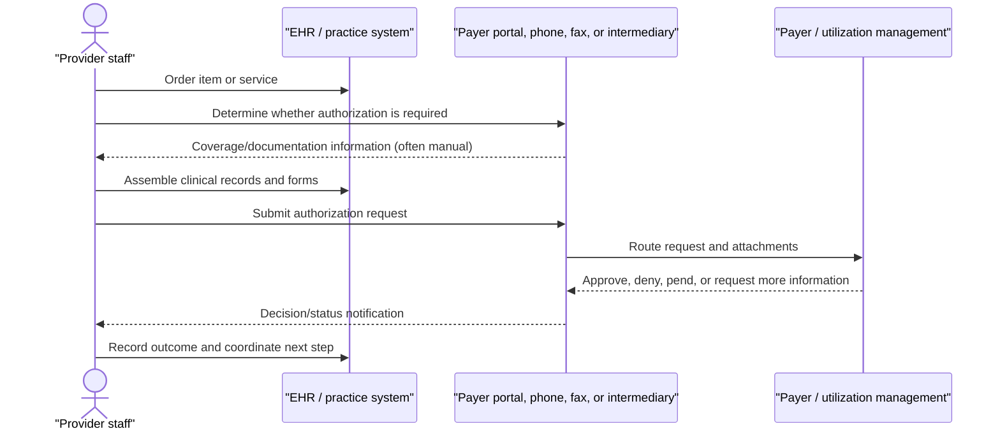
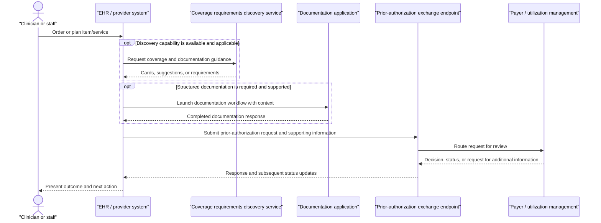

# Electronic prior-authorization workflow

## Purpose and boundary

This document establishes the first HealthForge domain model: electronic prior authorization for non-drug medical items and services in the CMS-0057-F context. It is a shared engineering model, not an operating policy, legal interpretation, or payer-specific implementation guide.

HealthForge does **not** participate in a patient-care transaction. Its role is to help engineering teams reason about the workflow, trace technical recommendations to authoritative sources, and plan a human-reviewed implementation.

The governing and technical references are pinned in the [MVP corpus manifest](../knowledge/manifests/mvp-source-corpus.yaml). In particular, CMS-0057-F governs the regulatory discussion; PAS, CRD, and DTR are candidate implementation guides whose applicability must be reviewed for a particular deployment.

## Participants and systems

| Participant | System role | Goal in the workflow | HealthForge relevance |
| --- | --- | --- | --- |
| Patient/member | Subject and beneficiary | Receives timely, appropriate care and communication | Patient data is out of MVP scope; use synthetic examples only |
| Ordering clinician/staff | Request initiator | Order a service and complete administrative work | Primary persona for workflow and acceptance criteria |
| Provider EHR or practice-management system | Clinical workflow client | Capture order/context; initiate discovery, documentation, and request flows | Main engineering integration surface |
| DTR application | Documentation workflow aid | Collect and pre-populate structured documentation where applicable | Candidate technical pattern, not an MVP dependency |
| Payer or delegated utilization-management system | Prior-authorization decision maker | Publish requirements, receive/review request, communicate decision/status | Main external system boundary |
| Clearinghouse/intermediary | Transaction relay, where used | Route/transform transactions under participant agreements | Deployment-specific; never assumed by default |
| HealthForge user | Product, architecture, FHIR, QA, or compliance reviewer | Convert requirements into reviewed engineering work | HealthForge’s direct user |

## Current-state workflow

The fragmented workflow is the problem HealthForge is trying to make easier to implement and maintain. It commonly contains manual eligibility/coverage checks, payer-portal navigation, document chasing, non-standard submission paths, and opaque status follow-up.

## Target electronic workflow

The target flow describes the technical capabilities an implementation team may need to assess. It does not imply that every payer supports every Da Vinci guide, that any particular transport is mandatory, or that automation removes human clinical/administrative review.

## Capability map

| Workflow capability | Purpose | Candidate standards touchpoint | Expected engineering questions |
| --- | --- | --- | --- |
| Determine requirement | Tell a provider whether authorization is needed | CMS Prior Authorization API context; CRD where selected | What triggers discovery? How is payer/plan identity resolved? |
| Discover coverage/documentation | Surface coverage rules and required information early | CRD, CDS Hooks, FHIR R4 context | Which hooks, resources, and local order events are applicable? |
| Collect documentation | Gather or pre-populate structured answers | DTR, Questionnaire/QuestionnaireResponse | Who launches it, persists drafts, and handles user edits? |
| Submit request | Deliver request and supporting clinical/administrative data | PAS; FHIR R4 Claim/ClaimResponse and related artifacts | What profile/package version, endpoint, authentication, and attachment rules apply? |
| Receive decision/status | Communicate approval, denial, pending, or additional-information needs | PAS response/status patterns; payer-specific operational process | How are states normalized, surfaced, retried, and audited? |
| Notify and retain evidence | Make the result actionable and reconstructable | Local EHR workflow and audit records | What reaches the clinician/patient, and what evidence is retained? |

## Domain concepts

| Concept | Meaning in this project | Do not assume |
| --- | --- | --- |
| Prior authorization request | Administrative request for payer review before an item/service is provided | That it is a claim, a guarantee of payment, or universally required |
| Requirement discovery | Identifying whether authorization and documentation are needed | That every payer exposes CRD or real-time rules |
| Documentation requirements | Information necessary for a payer to evaluate a request | That a static checklist is sufficient across plans or time |
| Submission | Transfer of a request plus supporting information | That all participants use the same endpoint, intermediary, or attachment approach |
| Decision | Payer/UM outcome, including need for more information | That a status is final, clinically appropriate, or automatically actionable |
| Evidence | Source citations, transaction records, and review decisions | That HealthForge is the system of record for clinical care |

## FHIR touchpoints for the first architecture conversation

This table is a discussion starter, not a conformance profile. The implementation team must pin the applicable package artifacts before claiming support.

| Area | Likely FHIR R4 concepts | Candidate guide | Notes |
| --- | --- | --- | --- |
| Patient and coverage context | Patient, Coverage, Organization, Practitioner/PractitionerRole | PAS / CRD | Identity, authorization, and payer-plan resolution are deployment-specific |
| Service/order context | ServiceRequest and related clinical context | CRD / PAS | The initiating event differs across EHR workflows |
| Coverage/documentation guidance | CDS Hooks context and FHIR references | CRD | Treat returned guidance as a user-facing decision-support input |
| Questionnaire documentation | Questionnaire, QuestionnaireResponse | DTR | Data provenance, consent, and user edits matter |
| Prior-authorization request/response | Claim, ClaimResponse, Bundle, supporting resources | PAS | PAS uses X12-aligned concepts and FHIR packaging; validate against the pinned IG |
| Attachments and clinical evidence | DocumentReference, Binary, or referenced clinical resources where supported | PAS / local policy | Do not introduce PHI into HealthForge’s MVP corpus or evaluations |

## Engineering failure modes to design for

- **Applicability mismatch:** the payer, product, service, or jurisdiction is outside the implementation’s supported boundary.
- **Stale requirements:** coverage/documentation rules or source guidance changed after an implementation decision.
- **Identity mismatch:** patient, provider, coverage, or payer identifiers cannot be resolved consistently.
- **Version mismatch:** counterparties support different FHIR, IG, API, terminology, or authentication versions.
- **Incomplete documentation:** required information is missing, unstructured, or inconsistent with the request.
- **Asynchronous processing:** a request is pended or needs more information; a synchronous response is not the final outcome.
- **Duplicate/retry behavior:** timeouts and retransmission create an ambiguous request state.
- **Human-workflow gap:** a response is technically received but not routed to the right person in time.
- **Audit gap:** an organization cannot reconstruct which requirement, source version, request, and decision informed work performed.

## Assumptions and open decisions

| ID | Assumption or question | Decision needed before implementation |
| --- | --- | --- |
| PA-01 | The first product use case remains non-drug items and services under CMS-0057-F. | Confirm target payer/provider segment and jurisdiction. |
| PA-02 | HealthForge analyzes public standards and regulations; it does not receive live clinical transactions. | Preserve no-PHI boundary in all local development, demos, and evaluations. |
| PA-03 | PAS, CRD, and DTR are useful reference points but not universal deployment requirements. | Select supported guide/package versions per integration scenario. |
| PA-04 | A provider EHR is the primary initiating system. | Decide whether the first design partner instead uses a portal, intermediary, or standalone app. |
| PA-05 | Responses may be asynchronous and need a human follow-up workflow. | Define state model, retry/idempotency behavior, notification ownership, and audit retention. |
| PA-06 | Payer-specific policies and connectivity vary. | Establish an adapter/configuration boundary rather than embedding payer rules in prompts or code. |

## HealthForge implications

For the first Regulation-to-Engineering Brief, this workflow means that an answer should identify: the persona and stage affected; the governing CMS passage; relevant candidate FHIR/IG artifact; assumptions about the provider/payer context; a proposed engineering change; and a human reviewer. The next issue defines that output contract formally.
