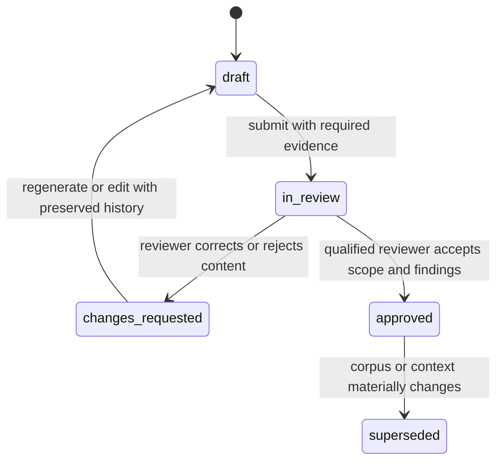

# Regulation-to-Engineering Brief contract

## Purpose

An Engineering Brief is the reviewable output of the first HealthForge workflow. It turns a bounded engineering question and a pinned source corpus into cited findings, candidate technical implications, proposed work, and explicit human decisions.

It is **not** a legal opinion, a compliance certification, an authorization decision, or an instruction to make an unreviewed production change.

The canonical interchange contract is [`packages/contracts/regulation-to-engineering-brief.schema.json`](../packages/contracts/regulation-to-engineering-brief.schema.json). A non-sensitive illustrative output is in [`knowledge/fixtures/regulation-to-engineering-brief.example.json`](../knowledge/fixtures/regulation-to-engineering-brief.example.json).

## Required sections

| Section | Purpose | Must be present before review? |
| --- | --- | --- |
| Metadata | Identify schema version, brief ID, creation time, and lifecycle state | Yes |
| Input | Preserve the question, project context, and selected corpus version | Yes |
| Source registry | Record every source version used and its provenance | Yes |
| Applicability | State scope, assumptions, exclusions, and unresolved questions | Yes |
| Summary | Plain-language orientation, clearly marked as generated synthesis | Yes |
| Findings | Atomic sourced claims or recommendations | Yes |
| FHIR/workflow implications | Candidate technical touchpoints, not asserted conformance | When relevant |
| Proposed work items | Reviewable backlog candidates with acceptance criteria | When recommendations are made |
| Review | Human decision history and corrections | Required to move beyond `draft` |
| Run record | Retrieval/model/prompt configuration sufficient for reproducibility | Yes |

## Evidence and citation policy

1. A finding tagged `requirement`, `interpretation`, or `recommendation` must reference at least one entry in `sources`.
2. Each citation must identify its source ID, source version, and a stable locator such as a PDF page/section, published-IG artifact, or immutable snapshot anchor.
3. The source registry must distinguish governing regulation, authoritative implementation guidance, candidate technical guidance, and internal/project material.
4. A citation supports the precise claim beside it. A relevant source link alone is insufficient.
5. The UI must render citations beside the claim—not only in a bibliography—and allow a reviewer to open the cited passage.
6. The system must never convert a retrieval score into a legal/compliance conclusion. `confidence` describes evidence support for the generated output, not regulatory certainty.
7. A missing citation, unsupported source version, or unresolved applicability question prevents a Brief from entering the `approved` lifecycle state.

## Lifecycle and human review

Humans can accept, reject, or correct each finding independently. A correction must retain the original generated text, reviewer rationale, reviewer identity, and timestamp. Approval means the identified reviewer accepted the Brief for its stated project context; it does not make HealthForge a source of legal or regulatory authority.

## Applicability and uncertainty rules

Every Brief must say what it does **not** know. The contract distinguishes:

- **Assumption:** a working premise that needs validation, such as the payer segment or deployment model.
- **Exclusion:** a known boundary, such as drug prior authorization or PHI processing in the MVP.
- **Open question:** information required before an engineering recommendation can be accepted.
- **Uncertainty:** a limitation in source evidence, source freshness, retrieval, or applicability.

The system should prefer `needs_information` or `out_of_scope` over a fluent but unsupported answer.

## Contract invariants beyond JSON Schema

JSON Schema validates shape; the application must also enforce these cross-field rules:

- `source_id` and `source_version` on every citation must match an entry in `sources`.
- Finding IDs, work-item IDs, and review-decision IDs must be unique in a Brief.
- A `review_decision` must reference an existing finding ID.
- An `approved` Brief requires at least one `accept` decision and zero unresolved `blocker` open questions.
- A finding that cites `candidate_technical_guidance` must not be rendered as a mandatory regulatory requirement.
- The corpus ID/version in input must match an approved corpus snapshot selected for the project.
- The run record must omit PHI and secrets; prompt and retrieved-passage references must point to protected, versioned records rather than copy sensitive content into audit events.

## Example boundary

The example Brief deliberately uses a project-policy source and synthetic project context. It demonstrates contract shape and review behavior; it does not assert a CMS requirement or prove a payer integration.
