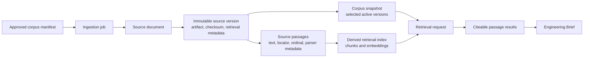
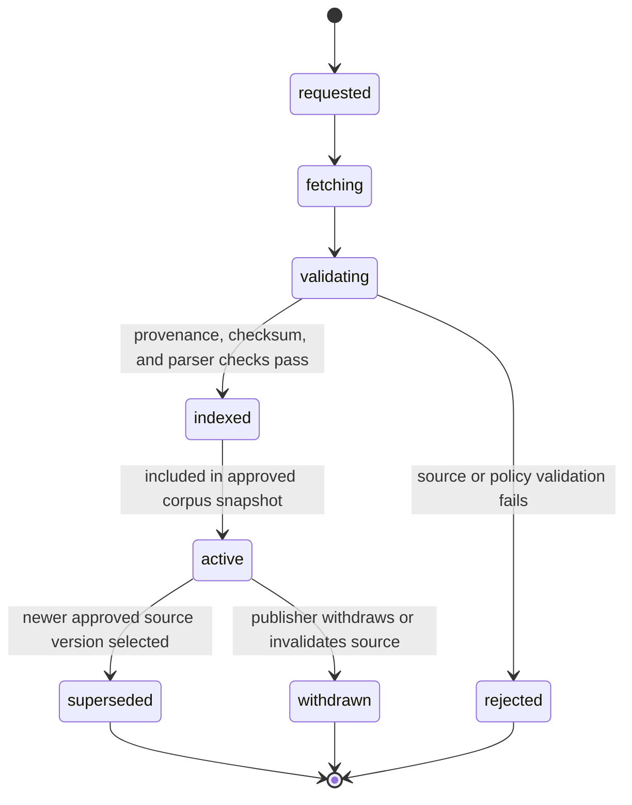

# Ingestion, provenance, and retrieval contract

## Purpose

This contract defines how a source selected by the [MVP corpus manifest](../knowledge/manifests/mvp-source-corpus.yaml) becomes citeable evidence for a HealthForge Brief. It is the boundary for the first local service: administrative ingestion and evidence retrieval over public, versioned source material.

The API shape is defined in [`packages/contracts/knowledge-ingestion-retrieval.openapi.yaml`](../packages/contracts/knowledge-ingestion-retrieval.openapi.yaml). It intentionally does not expose a general web crawler, arbitrary URL ingestion, PHI ingestion, or model generation endpoint.

## Canonical records and derived indexes

| Record | Immutable? | Purpose |
| --- | --- | --- |
| `SourceDocument` | No; identity record | Canonical publisher/source identity, not the content itself |
| `SourceVersion` | Yes | Exact artifact plus provenance, checksum, terms review, parser/chunking version |
| `SourcePassage` | Yes within a source version | The smallest citeable text unit, with stable locator and source order |
| `IngestionJob` | Append-only events | Operational history, validation outcome, and error evidence |
| `CorpusSnapshot` | Yes | Named set of active source-version IDs used for a run/evaluation |
| Retrieval index | Rebuildable | Search accelerator derived from passages; never the authoritative record |

## Required provenance

Every retrieval-eligible `SourceVersion` must preserve:

- manifest source ID, source title, publisher, and canonical URL;
- document/package version plus publication/effective date where applicable;
- immutable stored artifact URI, MIME type, byte size, SHA-256 checksum, and retrieval timestamp;
- allowed-use/terms review decision and reviewer;
- parser and chunking strategy versions;
- source status (`active`, `superseded`, `withdrawn`, or `rejected`); and
- links to any superseding/replaced source versions.

The runtime now persists `allowed_use`, `terms_review_decision`, `terms_reviewed_by`, and `terms_reviewed_at` on every ingested source version. A source is current-snapshot eligible only when its lifecycle status is `indexed` or `active` and its terms review decision is `approved`.

A `SourcePassage` must preserve its source-version ID, passage ID, ordinal, stable human locator (for example page plus heading or IG artifact plus anchor), text offsets in the normalized artifact, normalized text, and parser warnings. The service must return the source version and locator with every retrieval result.

## Ingestion lifecycle

Only an administrator-controlled manifest source may start an ingestion. The service must reject a request whose canonical URL/version is not selected by the manifest, whose checksum cannot be captured, whose content type is unsupported, or whose data classification is not public/non-sensitive. The ingestion request must also declare explicit allowed-use and terms-review metadata so the resulting source version is reviewable without consulting external notes.

## Normalization and passage rules

1. Preserve the original artifact before parsing it.
2. Normalize text deterministically, recording parser and normalization versions; do not rewrite a source’s meaning to improve retrieval.
3. Build passage boundaries from stable document structure first: page, section heading, implementation-guide artifact/anchor, and list/table boundaries.
4. Preserve source order and text offsets. If a passage must split for indexing, each child keeps the parent locator and a deterministic ordinal.
5. Store a display excerpt and normalized retrieval text separately when necessary; citations always resolve to the original passage/locator.
6. Never merge text across source versions. Never use a continuous-build guide as a retrieval baseline for the MVP.
7. Parser warnings (OCR uncertainty, missing page labels, broken anchors, or table extraction loss) make the passage review-required and prevent it from supporting a high-confidence material claim until remediated.

## Retrieval request and response rules

The first retrieval endpoint is intentionally narrow:

- caller supplies a `corpus_id`, `corpus_version`, non-sensitive question, and optional source-type filters;
- service resolves only active versions in that exact corpus snapshot;
- service returns ranked passages with source/version/locator, score, and index-generation ID;
- score is diagnostic ranking metadata, not evidence strength or compliance confidence;
- the service returns no generated answer, legal conclusion, or raw database/vector-store record;
- clients must pass returned passage references into the Brief evidence registry before citing them.

Default retrieval must favor citation precision over corpus breadth. A result from a candidate technical guide must retain its source type so the Brief renderer cannot label it as a regulatory requirement.

## Source updates, withdrawal, and reproducibility

An update never mutates a prior `SourceVersion`. A new artifact creates a new version, re-runs parsing/indexing, and is introduced by a new corpus snapshot. Existing Briefs and evaluation reports retain the old snapshot/version IDs for reproducibility.

If a publisher withdraws a source, mark the version `withdrawn`, remove it from new active snapshots, and preserve it for audit/history with a visible warning. If a source is merely superseded, retain it for historical Brief reconstruction but prevent it from silently appearing in a current snapshot. New runtime behavior enforces this at `POST /v1/corpus-snapshots`; callers must opt in with `include_historical_sources: true` to reconstruct a historical snapshot using superseded or withdrawn material.

## MVP controls and non-goals

- Administrative ingestion is local-only and authenticated when an API is introduced.
- The initial service accepts only curated public CMS/HL7 artifacts and synthetic fixtures; no PHI, customer files, credentialed web pages, or arbitrary user uploads.
- Object storage and PostgreSQL hold canonical metadata/content; a vector store is optional and derived.
- Indexes are rebuilt from canonical passages when parser, chunking, embedding, or retrieval configuration changes.
- The first implementation logs job IDs and configuration references, but not source text or sensitive query content into application logs.

## Acceptance criteria for the first local implementation

1. Ingest one manifest-approved public CMS PDF into an immutable version and passages with page/section locators.
2. Reject an unapproved URL, unsupported content type, or source without checksum/provenance fields.
3. Create a named corpus snapshot that selects the ingested version.
4. Retrieve at least one citeable passage for an eligible evaluation case and return version/locator metadata.
5. Re-run ingestion of the same artifact deterministically and detect the same checksum/version identity.
6. Record a superseding source version without altering the original version or a previously created snapshot.
