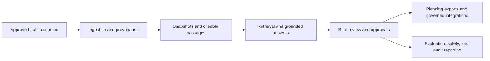

# Showcase architecture and solution narratives

This document is a presentation-ready narrative for explaining HealthForge to different audiences.

## Architecture in one sentence

HealthForge separates source evidence, retrieval, human review, approvals, evaluation, and governed downstream delivery so teams can reason about healthcare interoperability work without turning an LLM into the system of record.

## Architecture walkthrough

## Narrative by user type

### Reviewer

“Help me find the right evidence, draft a grounded Brief, and make explicit review decisions without losing traceability.”

### Approver

“Show me what was reviewed, what evidence backs it, and what I am actually approving before anything becomes planning input.”

### Auditor / evaluator

“Show me the trust signals: what the quality baseline says, how unsupported outputs are handled, and whether approvals and boundaries are really being enforced.”

### Administrator / operator

“Give me one place to inspect access, posture, deployment guidance, governed integrations, and demo-safe operational status.”

## Suggested testing paths

### Fast 5-minute walkthrough

- load the guided reviewer scenario
- create a grounded Brief
- inspect one finding and one citation
- switch to auditor and open the evaluation dashboard

### Operator walkthrough

- open compliance dashboard
- open policy and safety report
- open access review
- open deployment promotion guide

### Product showcase walkthrough

- explain the architecture
- show one reviewer flow
- show one admin flow
- close with deployable editions and capability boundaries
