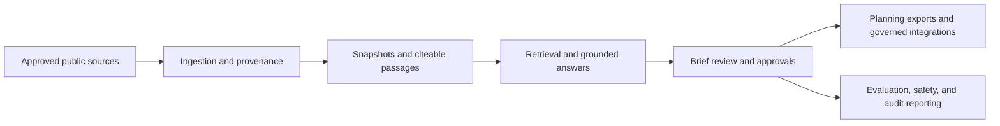

# Showcase architecture and solution narratives

This document is the presentation-ready explanation of what HealthForge is, how it works, and how to talk about it with different audiences.

## The short version

HealthForge helps healthcare interoperability teams turn public-source evidence into reviewable engineering decisions with citations, approvals, and governed downstream handoff.

## The 30-second pitch

HealthForge is not a generic healthcare chatbot.

It is a governed workflow layer that:

- builds a local evidence base from approved public sources
- retrieves cited evidence for bounded interoperability questions
- turns that evidence into reviewable Briefs
- records human review, approval, and audit history
- prepares teams for implementation planning without hiding where the reasoning came from

## Architecture in one sentence

HealthForge separates source evidence, retrieval, human review, approvals, evaluation, and governed delivery so teams can reason about healthcare interoperability work without turning an LLM into the system of record.

## Architecture walkthrough

## What to say in a meeting

### If someone asks “What problem are you solving?”

We are reducing the gap between what regulations and standards say, what teams think they mean, and what reviewers are actually willing to approve for implementation planning.

### If someone asks “Why not just use ChatGPT over PDFs?”

Because the hard part is not just generating text. The hard part is keeping evidence visible, making human review explicit, and preserving a governed trail from question to approved planning artifact.

### If someone asks “What is live today?”

Today HealthForge supports grounded evidence retrieval, Brief workflows, FHIR and prior-auth planning tools, workspace collaboration, trust dashboards, and governed implementation handoff inside a bounded local-first prototype.

## Narrative by user type

### Reviewer

“Help me find the right evidence, draft a grounded Brief, and make explicit review decisions without losing traceability.”

### Approver

“Show me what was reviewed, what evidence backs it, and what I am actually approving before anything becomes planning input.”

### Auditor or evaluator

“Show me the trust signals: how unsupported outputs are handled, what the evidence quality looks like, and whether approvals and boundaries are actually being enforced.”

### Administrator or operator

“Give me one place to inspect identity, access, posture, deployment guidance, governed integrations, and readiness claims without overselling maturity.”

### Builder or implementation lead

“Help me move from approved regulatory interpretation into a clearer implementation starting point without pretending code generation or delivery is autonomous.”

## Suggested testing paths

### Fast 5-minute walkthrough

- load the guided reviewer scenario
- create a grounded Brief
- inspect one finding and one citation
- switch to auditor and open the evaluation dashboard

### Product showcase walkthrough

- explain the architecture
- show one reviewer flow
- show one approver or auditor flow
- close with boundaries and why governance matters

### Operator walkthrough

- open compliance dashboard
- open policy and safety report
- open access review
- open regulated-readiness and deployment guidance views

## Honest closing statement

HealthForge is strong today as a governed interoperability research, review, and planning platform for public-source and synthetic workflows.

It is not yet claiming PHI handling, production SaaS maturity, or autonomous delivery. That honesty is part of the product quality, not a weakness to hide.
